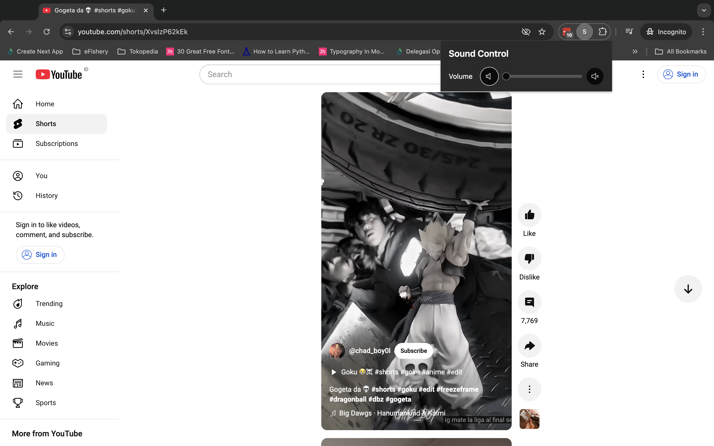

# React + TypeScript + Vite Chrome Extension

This template sets up a minimal environment to get a React app working with Vite, TypeScript, and hot module replacement (HMR) along with essential ESLint rules.

## Volume Control in Tabs

This application provides volume control for individual browser tabs, allowing you to manage audio levels across different tabs for a more personalized and comfortable browsing experience.

To use this feature:

1. Open any tab with audio.
2. Use the volume controls in the extension interface to adjust the volume specific to each tab, creating a customized audio experience.

We hope this feature enhances your browsing experience!

## Screenshots

### Main Interface


_Main application window with volume controls_


_Configuration options for volume adjustments_

---

### Volume Min


_Configuration options for volume adjustments_

---


_Configuration options for volume adjustments_

---

## Getting Started

### Installation

1. Install dependencies:

   ```bash
   yarn
   ```

2. Start the development server:
   ```bash
   yarn dev
   ```

### Building the Project

To build the project for production, run:

```bash
yarn build
```

This will generate a `dist` folder with all the necessary files for deployment as a Chrome extension.

---

## Installing the Extension in Chrome

1. **Build the Project**:
   Make sure you’ve run `yarn build` to create the production-ready files.

2. **Load the Extension in Chrome**:

   - Open Chrome and go to [chrome://extensions/](chrome://extensions/).
   - Enable **Developer mode** by toggling the switch in the top right corner.
   - Click **Load unpacked**.
   - Navigate to and select the `dist` folder generated by the build.

3. **Use the Extension**:
   - Once loaded, you should see the extension icon in Chrome’s toolbar.
   - Click on the extension icon to open the volume control interface, where you can adjust audio levels for individual tabs.

---

## Expanding the ESLint Configuration

To enhance code quality in production applications, consider updating the ESLint configuration for type-aware rules:

1. Set up `parserOptions` in `eslint.config.js`:

   ```js
   export default tseslint.config({
     languageOptions: {
       parserOptions: {
         project: ['./tsconfig.node.json', './tsconfig.app.json'],
         tsconfigRootDir: import.meta.dirname,
       },
     },
   });
   ```

2. Replace `tseslint.configs.recommended` with `tseslint.configs.recommendedTypeChecked` or `tseslint.configs.strictTypeChecked` for stricter rules.

3. Install `eslint-plugin-react` for React-specific linting and add to the config:

   ```js
   // eslint.config.js
   import react from 'eslint-plugin-react';

   export default tseslint.config({
     settings: { react: { version: '18.3' } },
     plugins: { react },
     rules: {
       ...react.configs.recommended.rules,
       ...react.configs['jsx-runtime'].rules,
     },
   });
   ```
